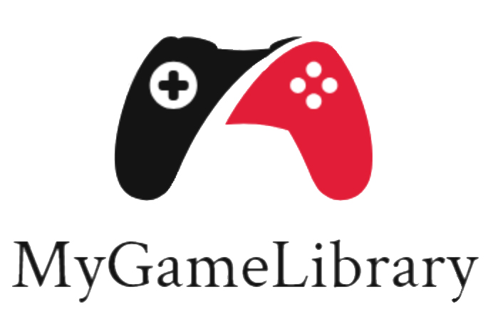

<div align="center">
  
  <p><strong>MyGameLibrary: Uma API para gerenciar os seus videogames!!</strong></p>

  
</div>

O MyGameLibrary é uma API REST, desenvolvida por mim, em Python, usando o framework FastAPI.

Atualmente, ela está em sua versão beta, versões mais aprimoradas estão por vir. Eu criei esse projeto com propósitos de estudo, para aprender na prática os conceitos do desenvolvimento de API's e também do framework. Portanto, o projeto ficará aberto para issues e pull requests, mas eu sempre analisarei se as mudanças sugeridas terão sentido para a minha trilha de aprendizado atual, pois quero sempre entender exatamente o que acontece em cada linha do código e, conceitos muito avancados podem me atrapalhar com isso.

## 🤔 O que essa API faz?
No MyGameLibrary, os usuários devem realizar o seu cadastro, e depois o login. O sistema de autenticação se dá por oauth2, o endpoint de login irá retornar um access token, o qual o usuário deve passar em todas as próximas requisições, no header Authorization, com a string "Bearer " antes. Caso o consumo seja feito pelo openapi (swagger), não é necessário se preocupar com isso, apenas faça o login clicando no botão "Authenticate".

Lembrando que o MyGameLibrary pode funcionar como uma espécie de BFF, ou seja, sinta-se livre para desenvolver um frontend para consumi-lo 😊.

Após cadastro e login, o usuário pode cadastrar todas as plataformas onde ele joga videogames, pode ser um Playstaion 5, um Nintendo Switch, um PC, o que for! Cada plataforma terá um número de id e será atrelada ao usuário logado. E então, o usuário pode cadastrar os jogos de cada plataforma, colocando informações básicas como nome do jogo, ano, categoria e o mais importante para essa API: o progresso.

Isso porque a intenção dessa API é oferecer ao usuário uma plataforma de gerenciamento de seus jogos, para que ele possa ter uma visão macro de todos os jogos que tem (ou todos que ele queira controlar, o uso é livre!), assim, ele pode se organizar, definir a ordem com a qual ele quer zerar os jogos, e registrar o seu progresso.

Portanto, é evidente que essa aplicação tem como alvo os jogos de modo campanha, visto que não é possível mensurar o progesso em porcentagem do seu CS (hehe), mas não significa que você não possa registrá-lo, a aplicação foi criada para te dar controle, e é isso mesmo que você terá, então, gerencie os seus videogames da maneira que for te deixar mais satisfeito!

## 👨🏻‍💻 Desenvolvimento
A API foi desenvolvida seguindo o padrão REST. Utilizei a linguagem Python e o framework FastAPI, escolhi esse framework por ser fácil de aprender, divertido de usar e ele ainda gera o swagger automaticamente, o que acho o máximo. Além disso, esse framework se popularizou por ser assíncrono, usa um servidor ASGI, diferentemente do Flask e o Django.

Eu utilizei para essa aplicação, a arquitetura de models e schemas. Onde os models são classes que refletem exatamente as suas tabelas no banco de dados e os schemas são classes que representam a estrutura dos JSON's tanto de request quanto de response. Esses schemas são escritos usando a classe BaseModel, da lib pydantic, com a qual o FastAPI trabalha em conjunto.

### Banco de dados:
Falando sobre dados, o SGDB utilizado é o SQLite, escolhido por ser leve, rápido e por não necessitar que seja inicializado ou coisa do tipo, isso porque o banco fica dentro de um arquivo .db localizado na raíz do projeto. Acho que isso me ajudará a fazer o deploy de maneira mais tranquila, pois deployment é um assunto que ainda estou estudando e não tenho muita proficiência.

### Testes:
Utilizei o Pytest para desenvolver os testes da aplicação, confesso que a parte de testes foi um pouco complicada para mim, não a parte do framework, acho o Pytest muito fácil de usar. O problema foi para mockar as funções, estudei e pesquisei muito mas não consegui entender e nem fazer funcionar, a minha meta é conseguir isso antes de lançar uma versão definitiva.

Atualmente os testes rodam de maneira em que a conexão com o banco de dados é realizada, então eles podem falhar às vezes, sendo necessário fazer alguns ajustes no banco de dados antes de sua execução.

Não utilizei o TDD para o desenvolvimento desta aplicação, os testes foram escritos após o término da aplicação em sí.

### Boas práticas
Segui o máximo possível as recomendações da PEP8 para a escrita do código, exceto nos testes, onde foi necessário ultrapassar o limite de 79 caracteres na linha.

Escrevi docstrings nos módulos, classes e funções sempre que necessário, além de comentários isolados, tudo para ajudar a entender melhor o que o código está fazendo.

## 💻 Como rodar o projeto na minha máquina?
Para rodar o MyGameLibrary em sua máquina, você precisa das seguintes ferramentas:
* Python 3.11.x instalado na máquina;
* Um terminal PowerShell;
* Um navegador web ou programas de teste de API como Postman ou Insomnia.

Agora é só seguir os passos abaixo:
### 1. Baixar o clonar o projeto em sua máquina
Você pode fazer o download do .zip do projeto ou usar o git clone para clonar em sua máquina (assim pode até sugerir contribuições).

### 2. Instalar os pacotes necessários
No terminal, preferencialmente PowerShell, execute o comando abaixo para instalar os pacotes necessários:
```powershell
pip install -r requirements.txt
```

### 3. Subir o servidor
Execute o comando abaixo, no diretório raíz do projeto, para subir o servidor uvicorn com a aplicação:
```powershell
uvicorn src.main:app
```

### 4. Checar o Swagger
Após subir a aplicação no localhost, acesse o Swagger pela url http:localhost:*porta*/docs. Pelo Swagger você poderá conferir todos os endpoints da aplicação e já testar por lá mesmo. Faça o seu cadastro e divirta-se!

### Responsável pelo projeto:
| [<br><sub>Fernando Fukunaga</sub>](https://github.com/fernando-fukunaga) |
| :---: |
