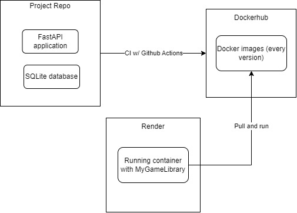

<div align="center">
  
  <p><strong>MyGameLibrary: An API for managing your video games!</strong></p>

  
</div>

MyGameLibrary is a REST API, developed by me, in Python, using the FastAPI web framework.

It's currently in beta version, more improved versions are on their way. I've created this project with studying purposes, to learn backend development concepts and stuff. Therefore, the repository is open for issues and pull requests, but, I'm always going to review them and see if they make sense in my learning path. Because I like to always know what every line of code is doing and, concepts that are too advanced may be an obstacle in the process.

## 🤔 How does the application work?
On MyGameLibrary, the users have to sign up, and then sign in to the API. The authentication system is made via OAuth2, the login endpoint will be returning an access token, which the user has to pass in the Authorization header of every subsequent request, with the string "Bearer " as a prefix. The header value will look like this: "Bearer \<access_token\>". If you're consuming the API via Swagger UI (available in the "/docs" endpoint), you don't need to worry about that part, just click in the "Authenticate" button and input your credentials.

After registering and singing in, the user can register all the platforms where they play video games, it can be a Playstation, a Nintendo, a computer, anything. Every registered platform will have an ID number that points to the logged in user. And than the user can register the specific games of each platform, inputting data like the name, the year, the category, and the most important thing, the progress.

That's because the intention is to offer to the users a game management platform, where they can get a good view of all of their games, how many of them are finished, how many are incomplete, how many are not even started, etc. And then the users can organize themselves, decide in what order they want to finish their games, keep track of the progress, and things like that.

Just a reminder that, MyGameLibrary can work as a BFF (backend for frontend), so feel free to create a frontend application to consume it 😊.

## 👨🏻‍💻 Development information
The application was developed under the REST parttern. I used the Python programming language and the FastAPI framework. This framework has become very popular for being asynchronous, using an ASGI server, in contrast to Flask or Django.

I used for this application, a MVC-like architecture, just changing the name of the components. The models are still being called models, the views are composed by routers (definition of the endpoints) and schemas (base model for data input/output using JSON), and the controllers are being called repositories.

* DBMS used: SQLite
* Testing: unit tests with Pytest

## 💻 How do I run this project on my computer?
To run MyGameLibrary in your device, you'll need the Python programming language installed. I recommend the 3.10 version or superior.

Now just follow those steps:
### 1. Download or clone the project
You can download the project's .zip file or just use git clone to clone it in your device (that way you can suggest contributions via pull request).

### 2. Create a virtual enviroment
It is a good practice to create a virtual enviroment in order to isolate the project and its dependencies from the actual language files on your computer. In Python, you can do it using the following command:
```powershell
python -m venv venv
```

### 3. Install the dependencies
On your terminal, run the following command to install all the project's dependencies:
```powershell
python -m pip install -r requirements.txt
```

### 4. Start up the server
Run the following command to start up the uvicorn server and hence, the application:
```powershell
uvicorn src.main:app
```

### 5. Check out the docs
After initializing the application on localhost, access the Swagger UI at *localhost:**port**/docs*. There you can check out every endpoint and test them as well. Just sign up and have fun!

## 🚀 Deploy
You can also access my application in the web now! Unfortunately, it can't be up and running 24/7 because I deployed it in a free PaaS, where it shuts down after a period of inactivity. So when accessing the service, maybe you'll have to wait some seconds or even minutes for the server to start up again and run the application, but after that, every request will be a lot faster, I promisse :D.

The URL is: [https://my-game-library-backend.onrender.com](https://my-game-library-backend.onrender.com)

And you can access the Swagger UI at: [https://my-game-library-backend.onrender.com/docs](https://my-game-library-backend.onrender.com/docs)

I've made a continuous integration pipeline using GitHub Actions to test, build and send an Docker image of this API to DockerHub. And than I run this image in a PaaS called [Render.com](https://render.com/), this is how I make my application visible for everyone. Here's a diagram of how the whole thing works:



### Project owner:
| [<br><sub>Fernando Fukunaga</sub>](https://github.com/fernando-fukunaga) |
| :---: |
